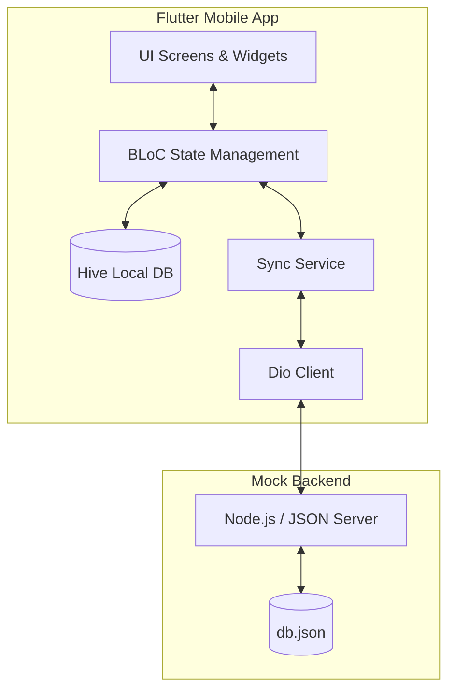

# IPOT - Customer ordering qr app

## Features

- **Digital Menu**: Browse categories and items with customizable options.
- **Order Tracking**: Real-time status updates (`pending` → `confirmed` → `preparing` → `ready` → `served`).
- **Offline Support**:
  - Menu data is cached locally using **Hive**.
  - Orders are queued when offline and automatically synced when connection is restored.

---

## Architecture Overview

The project follows a modular architecture designed for reliability, offline capability, and realtime feedback.

### High-Level Diagram



### Key Components

- **State Management (BLoC)**: Decouples business logic from UI. Each feature (Cart, Menu, Order) has its own BLoC to handle user events and state transitions.
- **Local Persistence (Hive)**: Acts as a local cache for menu items and a persistent queue for offline orders. This ensures the app remains functional without a network connection.
- **Synchronization Service**: Monitors network connectivity. When a connection is restored, it automatically pushes queued orders from Hive to the backend.
- **Networking (Dio)**: Handles HTTP communication with the backend, configured with interceptors for logging and error handling.
- **Mock Backend**: A lightweight Node.js server that provides a RESTful API, persisting data to a local `db.json` file for easy development and testing.

---

## Getting Started

### Prerequisites

- [Flutter SDK](https://docs.flutter.dev/get-started/install) (v3.22.0 or later)
- [Node.js](https://nodejs.org/) (for the mock backend)
- [Android Studio](https://developer.android.com/studio) or [VS Code](https://code.visualstudio.com/) with Flutter extension.

---

### 1. Setup Mock Backend

The backend uses `json-server` to simulate a REST API.

1. Navigate to the backend directory:
   ```bash
   cd backend
   ```
2. Install dependencies:
   ```bash
   npm install
   ```
3. Start the server:
   ```bash
   npm run dev
   ```
   *The server will run on `http://localhost:3000` (or the port specified in `package.json`).*

---

### 2. Setup Mobile App

1. Navigate to the mobile app directory:
   ```bash
   cd ipot_mobile
   ```
2. Install Flutter dependencies:
   ```bash
   flutter pub get
   ```
3. Setup environment variables:
   - Make the `.env` file in `ipot_mobile/` based on the `.env.example` file.
   - Ensure the `API_URL` points to your backend IP (e.g., `http://10.0.2.2:3000` for Android Emulator or you can use port forwarding e.g., `https://7889vgdz-3000.asse.devtunnels.ms/`).
4. Run the app:
   ```bash
   flutter run
   ```

---

## Testing

The project includes both unit and widget tests.

To run all tests:
```bash
cd ipot_mobile
flutter test
```

Specific test files:
- `test/models/order_test.dart`: Unit tests for data models.
- `test/screens/order_status_screen_test.dart`: Widget tests for the tracking screen.

---

## Tech Stack

- **Frontend**: Flutter, BLoC (State Management), Hive (Local DB), Dio (Networking).
- **Backend**: Node.js, JSON Server.
- **Navigation**: GoRouter.

## Developer notes testing

if you want to check order tracking feature, you can hardcode the db.json and change the status of the order manually to test the feature using this status values: `pending` → `confirmed` → `preparing` → `ready` → `served`. Also if you want to add estimation time you can hardcode this `"estimated_preparation_time": 15` in db.json in the orders array. If you want to test the offline support, you can disconnect the internet and then try to place an order. The menu screen should work without internet connection, the order tracking screen should work without internet connection and the order should be synced when the internet connection is restored.

## Troubleshooting

### Order status not updating
If the order status is not updating, try the following:
1. Check if the backend server is running.
2. Check if the API_URL is correctly set in the .env file.
3. Check if the internet connection is stable.
4. Restart the app.

## Building Notes IMPORTANTS
Before you build the apk, you need to set the API_URL in the .env file and make sure the server is running before testing with the apk. Use this following command to build the apk:
`flutter build apk --release`
